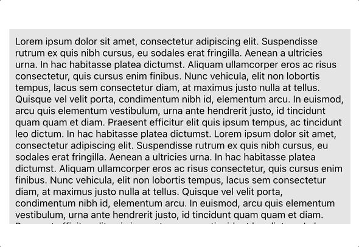

# react-concise-scrollbar

> a React concise scrollbar component with macOS style
## Advantages
- Concise and simple style (hidden when not in use)  
  
- Automatically adapt to the resize of wrapper and content area
  
- Based on traditional design strategy  
    The usage of **react-concise-scrollbar** fits well with developers' original development pattern.  
    When we need a scroll area, we should first creat a wrapper with exact height and set overflow:scroll or auto.
    Then put the content into the wrapper.When the height of the content exceeds the height of the wrapper, it could be scrolled.  
    If you want to use **react-concise-scrollbar** to change the scrollbar's style in your scroll area, you can just insert the component between the wrapper area and the content area.
- No need to send height or width to component as props  
    Since **react-concise-scrollbar** is used based on original design pattern, all you need to do is setting the correct height and width of the wrapper area in original mode.
    **react-concise-scrollbar** can automatically get these size and render correctly.
## Basic Usage
### Installation
```
npm i react-concise-scrollbar
```
### Import
```jsx
import {ConciseScrollBar} from "react-concise-scrollbar";
```
### Usage
**react-concise-scrollbar** is used based on the default scroll area.  
***Developers should make a default scroll area first and then insert the component between the wrapper and the content.***

js part
```jsx
function Example(){
    return(
        <div className="example-wrapper">
            <ConciseScrollBar>
                <div className="example-content">your content</div>
            </ConciseScrollBar>
        </div>
    )
}
```
css part (***set a scroll area***)
```scss
.example-wrapper{
  padding: 10px;
  overflow-y: scroll;
  overflow-x: hidden;   
  width: 400px;
  height: 400px;       
  background: lightblue;
}
```
### Use ref to control the scroll position
```jsx
    import {useRef} from "react";
    function Example(){
    const scrollRef = useRef();
    return(
        <div>
            <button className="scroll-button" onClick={() => {scrollRef.current.scrollTo(0,0)}}>
                Scroll to Top
            </button>
            <div className="example-wrapper">
                <ConciseScrollBar ref={scrollRef} behavior="smooth">
                    <div className="example-content">
                       your conetnt
                    </div>
                </ConciseScrollBar>
            </div>
        </div>
    )
}
```
## API
| Property | Type | Default | Description |
| :--- | :--- | :--- | :--- |
| scrollY  | boolean | true | If you set scrollY to false, react-concise-scrollbar will not be available. |
| behavior | 'auto' or 'smooth' | 'auto' | Change scroll-behavior in react-concise-scrollbar. |
| ref      | object | - | Send React ref as ref props to the component, you can use customized methods to scroll the window. |
| key      | string | - | Each components' unique key. |

